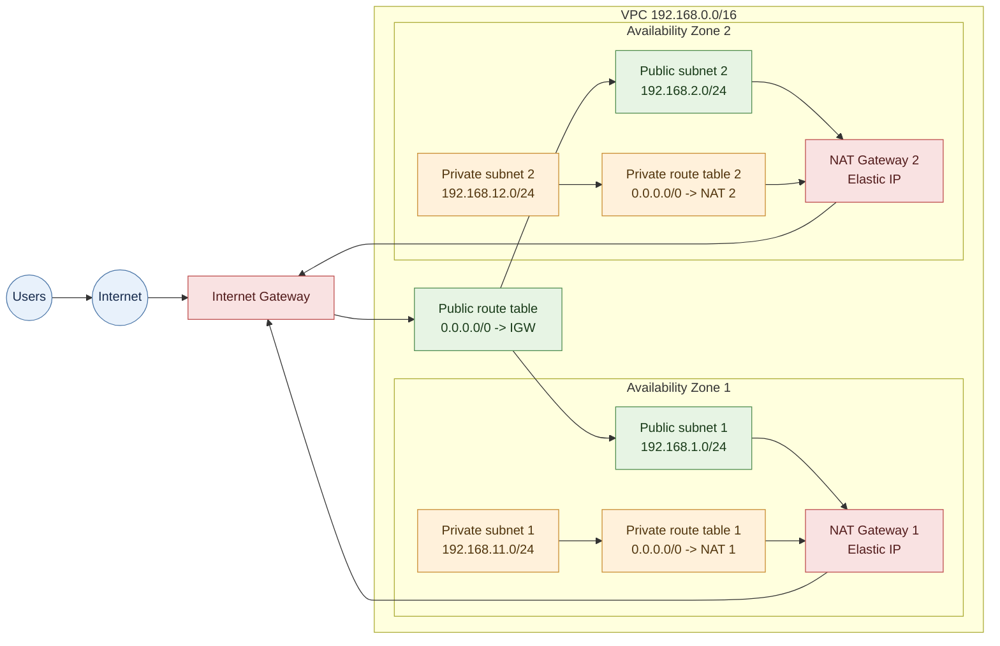

# Terraform

This directory contains the Terraform root configuration and reusable VPC
module for the visitor counter infrastructure.

## VPC architecture

The configuration creates a VPC in `ap-south-1` with CIDR `192.168.0.0/16`.
The first two available Availability Zones in the region are used.

| Tier | Subnet | CIDR | Internet path |
| --- | --- | --- | --- |
| Public | Public 1 | `192.168.1.0/24` | Internet Gateway |
| Public | Public 2 | `192.168.2.0/24` | Internet Gateway |
| Private | Private 1 | `192.168.11.0/24` | NAT Gateway 1 |
| Private | Private 2 | `192.168.12.0/24` | NAT Gateway 2 |

Each public subnet has a NAT Gateway with an Elastic IP. Each private subnet
has its own route table and sends `0.0.0.0/0` through the NAT Gateway in the
same Availability Zone. Private subnets can initiate outbound connections,
but they do not accept direct inbound connections from the internet.



The VPC is implemented as the reusable local module in
`modules/vpc`. Root-level values are defined in `variables.tf` and supplied
through `terraform.tfvars`.

The S3 backend stores state at `visitor-counter/terraform.tfstate` and uses
Terraform's native S3 lockfile support. The state bucket must be created before
running Terraform.

## Bootstrap the state bucket

Use a globally unique bucket name and an AWS region:

```bash
./bootstrap-state.sh my-unique-visitor-counter-tfstate ap-south-1
```

The script enables versioning, server-side encryption, S3 public-access
blocking, and bucket-owner-enforced object ownership. It is safe to run again
for an existing bucket. The caller needs permission to manage the bucket and
to call `sts:GetCallerIdentity`.

Set the printed `TF_STATE_BUCKET` and `AWS_REGION` as GitHub Actions repository
variables. Also set `AWS_ROLE_ARN` to a restricted IAM role trusted by this
repository's GitHub Actions OIDC provider. The role needs Terraform state
access to the bucket, including `GetObject`, `PutObject`, and `DeleteObject`
for both the state object and its `.tflock` object.

## Deployment requirements

1. Add AWS credentials through GitHub Actions OIDC and restrict the role to the intended environment.
2. Review the plan before applying infrastructure changes.
3. Review the destroy plan before confirming deletion.

## Run locally

Initialize the backend using the state bucket created by `bootstrap-state.sh`:

```bash
terraform init -backend-config="bucket=$TF_STATE_BUCKET" -backend-config="region=$AWS_REGION"
terraform validate
terraform plan -out=tfplan
terraform apply tfplan
```

The Terraform deployment workflow runs automatically for changes under
`terraform/` pushed to `main`, and can also be started manually. The destroy
workflow is manual and requires typing `DESTROY` as confirmation.

NAT Gateways and their Elastic IPs incur AWS charges while they exist. Use the
destroy workflow only after reviewing its plan when the environment is no
longer needed.
